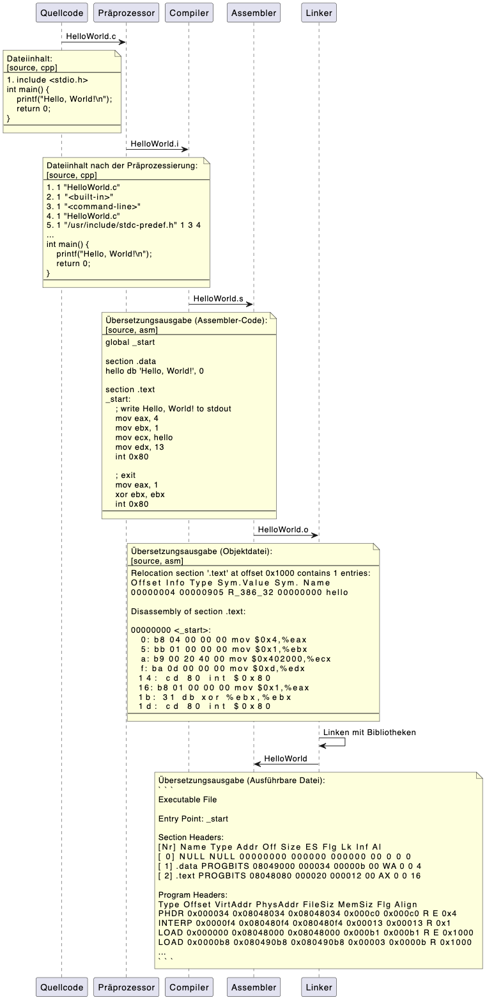

# Erklärung der C-Programmierwerkzeuge

Um ein C-Programm auszuführen, muss es durch eine Reihe von Werkzeugen verarbeitet werden, die als Programmierwerkzeuge bezeichnet werden. Diese Werkzeuge sind für die Übersetzung des Quellcodes in Maschinencode verantwortlich, der von einem Computer ausgeführt werden kann.

### Die vier wichtigsten C-Programmierwerkzeuge sind:

- Präprozessor
- Compiler
- Assembler
- Linker

### Präprozessor

Der Präprozessor ist das erste Werkzeug, das den Quellcode verarbeitet. Er kümmert sich um Aufgaben wie:

- Einfügen von Include-Dateien
- Definieren von Makros
- Ersetzen von Platzhaltern

### Compiler

Der Compiler ist das wichtigste Werkzeug, das den Quellcode verarbeitet. Er übersetzt den Quellcode in Maschinencode, der von einem Computer ausgeführt werden kann.

Der Compiler arbeitet in mehreren Schritten:

1. Parsing: Der Compiler analysiert den Quellcode und erzeugt eine interne Repräsentation des Codes.
2. Semantikprüfung: Der Compiler überprüft den Quellcode auf Fehler.
3. Codegenerierung: Der Compiler erzeugt den Maschinencode für den Quellcode.

### Assembler

Der Assembler ist ein Werkzeug, das den Maschinencode in eine binäre Form übersetzt, die von einem Computer ausgeführt werden kann.

### Linker

Der Linker ist ein Werkzeug, das mehrere Objektdateien zu einer ausführbaren Datei zusammenfügt. Objektdateien sind Dateien, die den Maschinencode für eine einzelne Funktion oder eine einzelne Klasse enthalten.

## Beispiele und Erklärungen

### Präprozessor

Ein Beispiel für die Verwendung des Präprozessors ist die Verwendung von Include-Dateien. Include-Dateien enthalten Definitionsdateien, die von anderen Quelldateien verwendet werden können.

Zum Beispiel könnte eine Include-Datei die folgenden Definitionen enthalten:

```C
#define PI 3.14159
#define SQUARE(x) (x * x)
```

Diese Definitionen können dann in anderen Quelldateien verwendet werden, indem die Include-Datei mit der #include-Direktive eingebunden wird.

Zum Beispiel könnte die folgende Quelldatei die PI-Definition verwenden:

```C
#include "my_defs.h"

int main() {
  printf("Der Wert von PI ist %f.\n", PI);
  return 0;
}
```

Dies würde den folgenden Text auf der Konsole ausgeben:

> Der Wert von PI ist 3.14159.

### Compiler

Ein Beispiel für die Verwendung des Compilers ist die Verwendung von Variablendeklarationen. Variablendeklarationen definieren neue Variablen und geben ihren Datentyp an.

Zum Beispiel könnte die folgende Quelldatei eine Variable `i` vom Typ `int` deklarieren:

```C
int i;
```

Diese Deklaration würde dem Compiler mitteilen, dass die Variable `i` einen ganzen Zahlenwert speichern kann.

### Assembler

Ein Beispiel für die Verwendung des Assemblers ist die Verwendung von Anweisungen. Anweisungen sind Befehle, die dem Computer sagen, was er tun soll.

Zum Beispiel könnte die folgende Quelldatei die Anweisung `i = 10` enthalten:

```C
int i;

i = 10;
```

Diese Anweisung würde dem Compiler mitteilen, dass die Variable `i` den Wert 10 erhalten soll.

### Linker

Ein Beispiel für die Verwendung des Linker ist die Verwendung von Bibliotheken. Bibliotheken sind Sammlungen von Funktionen, die von anderen Programmen verwendet werden können.

Zum Beispiel könnte die folgende Quelldatei die Funktion `printf()` aus der Bibliothek `stdio.h` verwenden:

```C
#include <stdio.h>

int main() {
  printf("Hello, World!\n");
  return 0;
}
```

Diese Quelldatei würde den folgenden Text auf der Konsole ausgeben:

> Hello, World!

Der Linker würde die Bibliothek `stdio.h` finden und die Funktion `printf()` in die ausführbare Datei einfügen.

### Fazit

Die C-Programmierwerkzeuge sind wichtig für die Übersetzung von C-Quellcode in Maschinencode. Durch das Verständnis dieser Werkzeuge können Sie C-Programme effektiver schreiben und debuggen.

